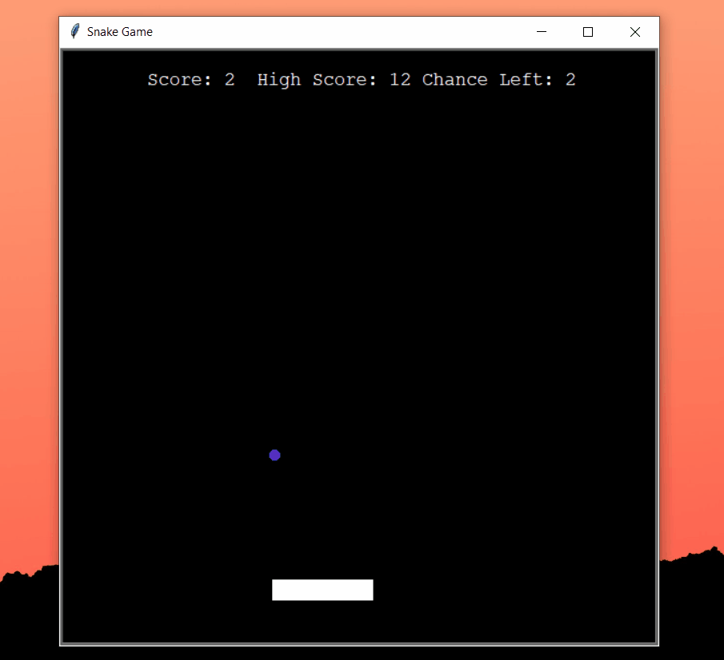

# snake_game

## Python package used: PythonTurtle

I wanted to make a classic snake game that we got to know for the first time on a Nokia 3310 mobile phone. I wanted to recreate that experience with python. 

## Gameplay

The player controls three turtle square instances on a bordered plane. As it moves forward, it leaves a trail behind, resembling a moving snake. The snake has a specific length, so there is a moving tail a fixed number of units away from the head. The tail size increases when the head of the snake touches(eats) the blue circle(food), this also updates the scoreboard. The player loses when the snake runs into the screen border, a trail, other obstacle, or itself. 

## Game controls 

### UP with up arrow ⏶
### DOWN with down arrow ⏷
### RIGHT with right arrow ⏵
### LEFT with left arrow ⏴
